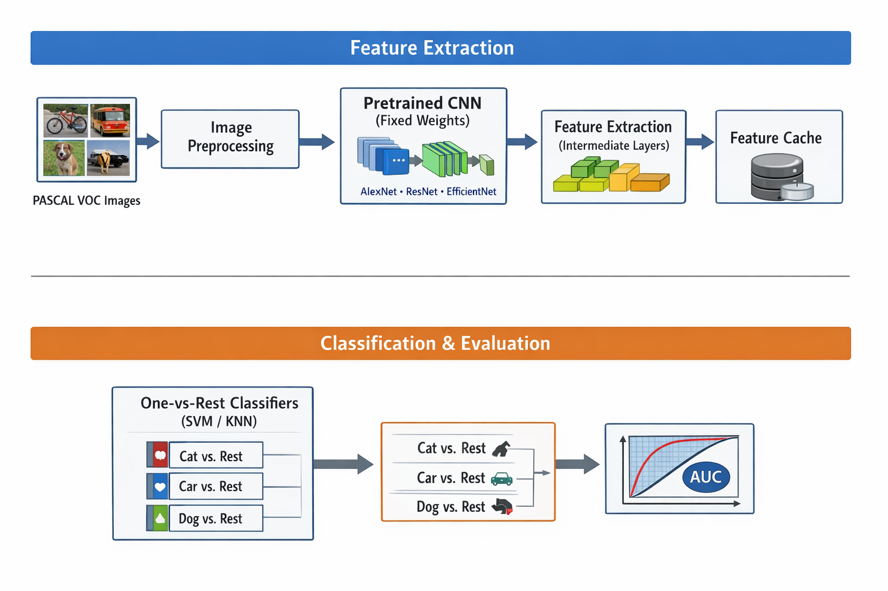

# PASCAL_VOC_ObjectClassification

## Overview

This repository contains a MATLAB-based implementation of an object recognition
pipeline developed for the PASCAL Visual Object Classes (VOC) Challenge.
The project was carried out within the course *Imaging Analysis and Processing (AIPI)*.

The task addressed is **multi-class object presence classification** on the
PASCAL VOC 2006 dataset, which contains images with complex scenes, occlusions,
and high intra-class variability.

The system follows the **official PASCAL VOC protocol** and evaluates image-level
object classification across 10 categories:
bicycle, bus, car, motorbike, cat, cow, dog, horse, sheep, and person. :contentReference[oaicite:1]{index=1}

---

## Workflow Overview

---

## Repository Structure

The repository is organized as follows:

- `src/`  
  MATLAB source code implementing data loading, feature extraction,
  classifier training, and evaluation.

- `data/`  
  Expected location of the PASCAL VOC Development Kit (not included).

- `results/`  
  Evaluation results organized by CNN backbone, classifier, and feature layer.
  A dedicated `results/README.md` documents the results structure in detail.

- `README.md`  
  Project-level documentation (this file).

---

## Classification Strategy

The project adopts a **two-stage hybrid strategy** instead of end-to-end deep learning:

### 1. Deep Learning for Feature Extraction (Transfer Learning)

- Pretrained CNNs are used to extract feature embeddings from intermediate layers.
- Networks are pretrained on ImageNet.
- No fine-tuning or backpropagation is performed.
- CNNs are treated as fixed feature extractors.

Architectures evaluated include:
- AlexNet
- ResNet101
- EfficientNet
- MobileNet

### 2. Classical Machine Learning for Classification

- Extracted deep features are used to train supervised classifiers:
  - Support Vector Machine (SVM)
  - K-Nearest Neighbors (KNN)
- Classification follows a **one-vs-rest** scheme, with one binary classifier per object class.

This design enables systematic comparison of:
- CNN backbones
- Feature extraction layers
- Classifier behavior

### CNN Backbones

### Deep Learning Architectures Overview

| Architecture  | Total Parameters | Depth (Number of Layers) | Generalization Capacity | Computational Requirements |
|---------------|------------------|--------------------------|-------------------------|----------------------------|
| AlexNet       | Medium           | 8                        | Low–Medium              | Low                        |
| ResNet101     | High             | 101                      | High                    | High                       |
| EfficientNet  | Moderate         | Variable (version-dependent) | Very High           | Optimized                  |
| MobileNet     | Low              | Medium                   | Medium                  | Very Low                   |

---

## Practical Issues, Difficulties, and Solutions

### Representative Feature Selection
**Problem:** Classical descriptors (SIFT, HOG) showed weak performance on VOC images
due to occlusions and high variability.  
**Solution:** Replaced handcrafted descriptors with pretrained CNN embeddings,
which provided more robust and discriminative features. :contentReference[oaicite:3]{index=3}

### Handling “Difficult” Objects
**Problem:** VOC annotations include samples marked as *difficult*, which distort
training and evaluation.  
**Solution:** Difficult samples were excluded from both training and validation,
following VOC Development Kit recommendations. :contentReference[oaicite:4]{index=4}

### File Structure and Data Access
**Problem:** VOC evaluation scripts require a strict directory layout.  
**Solution:** The official VOC folder structure was enforced and all required paths
were configured via `VOCinit.m`. :contentReference[oaicite:5]{index=5}

### Computational Efficiency
**Problem:** CNN feature extraction is computationally expensive.  
**Solution:** Extracted features were cached to disk, training was limited to
train/val splits, and minibatch inference was used when possible. :contentReference[oaicite:6]{index=6}

### One-vs-Rest Classifiers
**Problem:** VOC evaluation requires consistent binary classifiers per class.  
**Solution:** Independent classifiers were trained per class using the official
`<class>_train.txt` and `<class>_val.txt` splits. :contentReference[oaicite:7]{index=7}

---

## Evaluation Protocol and Metrics

- Dataset: PASCAL VOC 2006
- Task: Image-level object classification
- Metrics:
  - ROC (Receiver Operating Characteristic) curves
  - AUC (Area Under the Curve)

AUC is used as the primary scalar metric:
- 1.0 indicates perfect classification
- 0.5 corresponds to random performance :contentReference[oaicite:8]{index=8}

---

## Results Summary

### Best Configurations
- **AlexNet:** fc7 + SVM  
- **ResNet101:** pool5 + SVM  
- **MobileNet-v2:** global_average_pooling2d_1 + SVM  
- **EfficientNet-b0:** global_average_pooling2d + SVM  

These configurations achieved consistently high AUC values across most object
classes.

### Intermediate Configurations
- Final or near-final layers (e.g. fc8, logits, fc1000) with SVM
- Good performance, but reduced generalization due to ImageNet specificity

### Worst Configurations
- KNN-based classifiers across all CNNs
- Significant performance drops, especially for challenging categories
  such as *person* and *horse* :contentReference[oaicite:9]{index=9}

###Table Summary

| CNN Backbone      | Best Configuration (Layer + Classifier) | Intermediate Configuration | Worst Configuration |
|-------------------|------------------------------------------|----------------------------|---------------------|
| AlexNet           | fc7 + SVM                                | fc8 + SVM                  | fc8 + KNN           |
| ResNet101         | pool5 + SVM                              | fc1000 + SVM               | pool5 + KNN         |
| MobileNet-v2      | global_avg_pooling2d_1 + SVM              | logits + SVM               | global_avg_pooling2d_1 + KNN |
| EfficientNet-b0   | global_avg_pooling2d + SVM                | dense / MatMul + SVM       | global_avg_pooling2d + KNN   |

---

## Future Work and Key Takeaways

### Key Takeaways
- Pretrained CNNs provide strong transferable representations for VOC-like datasets.
- SVM consistently outperforms KNN when classifying high-dimensional deep features.
- Intermediate CNN layers are more transferable than final classification layers.

### Future Work
- Full fine-tuning of pretrained CNNs with access to stronger GPU resources
- Evaluation of newer architectures (EfficientNet-v2, Vision Transformers)
- Advanced data augmentation strategies
- Model ensembles and self-supervised learning approaches :contentReference[oaicite:10]{index=10}

---

## References

- Everingham et al., *The Pascal Visual Object Classes (VOC) Challenge*, IJCV, 2010.
- Simonyan & Zisserman, *Very Deep Convolutional Networks for Large-Scale Image Recognition*, 2015.
- He et al., *Deep Residual Learning for Image Recognition*, CVPR 2016.
- PASCAL VOC Challenge: http://host.robots.ox.ac.uk/pascal/VOC/
- VLFeat Toolbox: http://www.vlfeat.org/
- PRTools Toolbox: https://prtools.tudelft.nl/ :contentReference[oaicite:11]{index=11}
